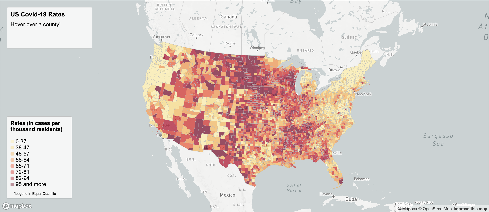
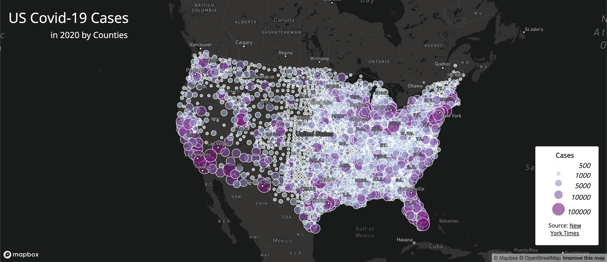

# GEOG 458 Lab 3: Web Map Application

This github repository hosts two thematic maps, one is a choropleth map of the covid-19 rates and the other is a proportional symbols map of covid-19 cases.

## US Covid-19 Rates
### [Interactive Map 1](https://chalsea2000.github.io/geog458covidcases/map1.html) : 

 

This choropleth map shows the US Covid-19 Rates per counties (in cases per thousand residents). This map interface allows users to hover above any counties they are curious in and displays the individual case rates for that particular county.

## US Covid-19 Cases
### [Interactive Map 2](https://chalsea2000.github.io/geog458covidcases/map2.html) :

This proportional symbol map shows the US Covid-19 Cases per counties. This map interface allows users to check on the total cases per county by clicking on the individual dots. 

## Data Sources
This project uses datasets from the [New York Times](https://github.com/jakobzhao/geog458/tree/master/labs/lab03), which is in reference to the [2018 ACS 5 year estimates](https://data.census.gov/cedsci/table?g=0100000US%24050000&d=ACS%205-Year%20Estimates%20Data%20Profiles&tid=ACSDP5Y2018.DP05&hidePreview=true) and [U.S. Census Bereau](https://www.census.gov/geographies/mapping-files/time-series/geo/carto-boundary-file.html).

## Other Resources
[Lab 3: Web Map Application](https://github.com/jakobzhao/geog458/tree/master/labs/lab03) with Instructor Bo Zhao
[Lab 4: Interactive Web Mapping](https://github.com/jakobzhao/geog495/tree/main/labs/lab04) with Instructor Bo Zhao
